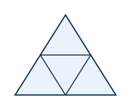
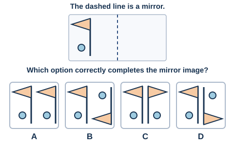
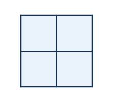
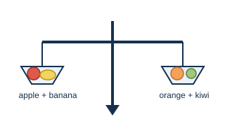
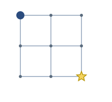
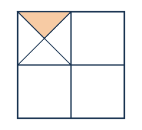
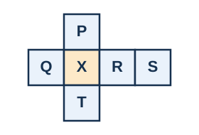

# Week 12+ (Optional) — Math Kangaroo-Style Stretch

Not part of the core 12-week plan or any Indian olympiad's syllabus — this
is the **optional extension** mentioned in `docs/01-syllabus.md` §3 and
`docs/03-practice-plan.md`. Attempt it only after you're comfortably
scoring well on the 6 sample papers. Math Kangaroo (international) leans
harder into spatial reasoning, logic, and "aha" puzzles than SOF-IMO does,
so this is a different flavour of difficulty, not more of the same.

15 questions in 3 difficulty tiers, loosely modelled on the real
competition's point-value structure (harder questions are worth more).
4-option MCQ throughout, untimed.

---

## Tier 1 — 3 points each (Q1–Q5)

**Q1.** Look at the pattern: ○ △ ○ △ ○ ?
What comes next?
A) ○  B) △  C) □  D) ◇

**Q2.** How many triangles are there in the figure below (count every triangle you can find, including ones made up of smaller ones)?

A) 4  B) 5  C) 6  D) 8

**Q3.** A bag has 3 red balls and 2 blue balls. Without looking, you take out balls one at a time. What is the smallest number of balls you must take out to be **sure** you have at least one of each colour?
A) 2  B) 3  C) 4  D) 5

**Q4.**

**Q5.** In a race, Tom finished 2 places ahead of Jerry. Jerry finished 3 places ahead of Spike. If Spike finished 7th, what place did Tom finish?
A) 1st  B) 2nd  C) 3rd  D) 5th

## Tier 2 — 4 points each (Q6–Q10)

**Q6.** How many squares are there in the figure below (count every square you can find, including the big one)?

A) 4  B) 5  C) 6  D) 9

**Q7.** The sum of two numbers is 50. One number is 4 times the other. Find the smaller number.
A) 8  B) 10  C) 12  D) 15

**Q8.** On the balance scale below, 1 apple + 1 banana balances 1 orange + 1 kiwi, and 1 orange alone balances 2 kiwis. If 1 kiwi weighs 50 g, and the apple and banana weigh the same as each other, how much does 1 apple weigh?

A) 50 g  B) 60 g  C) 75 g  D) 100 g

**Q9.** Starting at the dot and moving only **right** or **down** along the grid lines, how many different paths lead to the star?

A) 4  B) 6  C) 8  D) 9

**Q10.** Take a number. Double it, then subtract 7. Multiply that result by 3, and you get 45. What was the original number?
A) 9  B) 10  C) 11  D) 13

## Tier 3 — 5 points each (Q11–Q15)

**Q11.** Four friends — Ann, Bob, Cara, Dan — each have a different favourite fruit: apple, banana, cherry, date.
- Ann doesn't like banana or date.
- Bob likes cherry.
- Cara doesn't like apple.
- Dan likes date.

What is Ann's favourite fruit?
A) Apple  B) Banana  C) Cherry  D) Date

**Q12.** The large square below is split into 4 equal quadrants. One quadrant is further divided into 4 equal triangles by its two diagonals, and one of those triangles is shaded. What fraction of the **whole large square** is shaded?

A) 1/16  B) 1/8  C) 1/4  D) 1/2

**Q13.** How many 2-digit numbers have digits that add up to 9?
A) 7  B) 8  C) 9  D) 10

**Q14.** The flat shape below can be folded along its edges to form a cube. Which face will end up **opposite** face X?

A) P  B) Q  C) R  D) S

**Q15.** A snail is at the bottom of a 10-metre well. Each day it climbs up 3 metres, but each night it slides back down 2 metres (except once it reaches the top, it stops climbing for good and doesn't slide back). On which day does it first reach the top?
A) Day 7  B) Day 8  C) Day 9  D) Day 10
